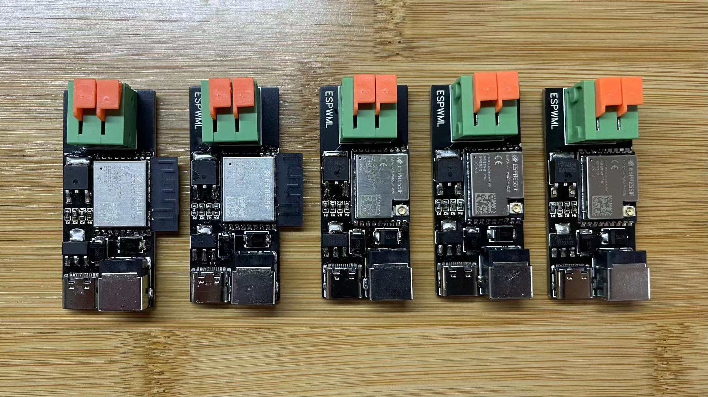

# ESPWM

## 简介



讨论群: `810581215`

在`1.0`基础上添加`TYPE-C`、`DC`、快拆接口方便刷机和供电，替换`C3`模块为乐鑫的（安信可和乐鑫关系崩了），`PCB`兼容两个版本的`C3`模块，不带天线`ESP32-C3-WROOM-02U-N4`和带天线`ESP32-C3-WROOM-02-H4`	，支持`5V~12V`供电

### `材料清单`

| 名称                                      | 型号      | 数量 |  PCB 标注  |                           链接                           |
| ----------------------------------------- | --------- | ---: | :--------: | :------------------------------------------------------: |
| ME1117A33B3G 封装SOT-223 | -         |    1 |     1117-3    | [购买](https://item.taobao.com/item.htm?id=668286085588) |
| AOD4184 D4184 N 沟道场效应 MOS 管 50A 40V | -         |    1 |     A1     | [购买](https://item.taobao.com/item.htm?id=621661261124) |
| 贴片电阻 0603 100R                        | 0603 100R |    1 |    R1     | [购买](https://item.taobao.com/item.htm?id=642138541174) |
| 贴片电阻 0603 10K                         | 0603 10K  |    3 |     R2/R3/R4   | [购买](https://item.taobao.com/item.htm?id=642138541174) |
|SS54 SMB 肖特基二极管                  | -         |    2 |  D1/D2        | [购买](https://item.taobao.com/item.htm?id=522555071084) |
| 2.4G 内置柔性 FPC 软天线                  | -         |    1 |     -      | [购买](https://item.taobao.com/item.htm?id=574057911861) |
| Type-C母座 16P | - | 1 | TYPE-C | [购买](https://item.taobao.com/item.htm?&id=573090887123) |
| DC直流电源插座 | 5.5-2.1mm/2.5mm | 1 | DC | [购买](https://item.taobao.com/item.htm?id=597934128320) |
| KF142R-5.08-2| 2P | 1 | KF142R | [购买](https://item.taobao.com/item.htm?id=597934128320) |
| ESP32-C3-WROOM-02U-N4 |- | 1 | ESP32-C3-WROOM-02-H4 | [购买](https://item.taobao.com/item.htm?id=676812781013) |
| ESP32-C3-WROOM-02-H4 | - | 1 | ESP32-C3-WROOM-02-H4 | [购买](https://item.taobao.com/item.htm?id=672590753429) |

### `ESPHome`

```yaml
substitutions:
  device_name: second_espwml_desk_light

esphome:
  name: ${device_name}

esp32:
  board: esp32-c3-devkitm-1
  framework:
    type: arduino

logger:

api:
  encryption: 
    key: !secret api_encryption_key

ota:
  password: !secret ota_password

wifi:
  ssid: !secret wifi_ssid
  password: !secret wifi_password
  fast_connect: on

web_server:
  port: 80

button:
  - platform: restart
    name: ${device_name}_reboot

text_sensor:
  - platform: wifi_info
    ip_address:
      name: ${device_name}_ip
    mac_address:
      name: ${device_name}_mac

sensor:
  - platform: uptime
    name: ${device_name}_uptime
  - platform: wifi_signal
    name: ${device_name}_signal

output:
  - platform: ledc
    frequency: 1000Hz
    pin: 0
    id: ${device_name}_ledc

light:
  - platform: monochromatic
    output: ${device_name}_ledc
    name: ${device_name}
```