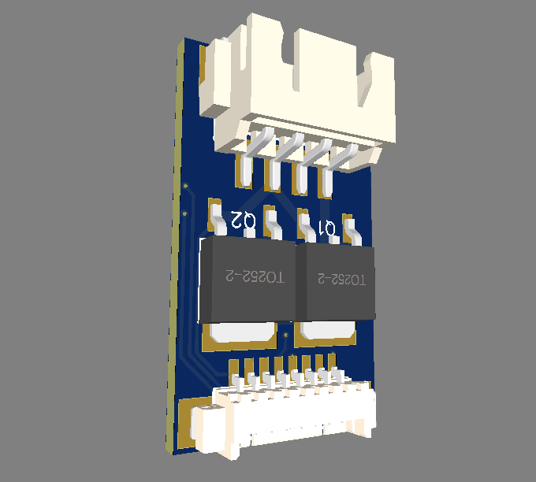
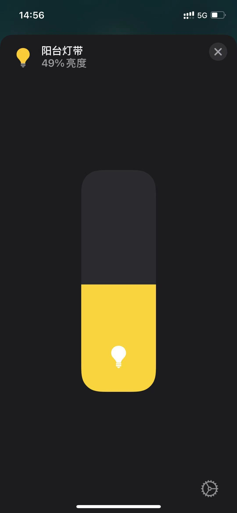
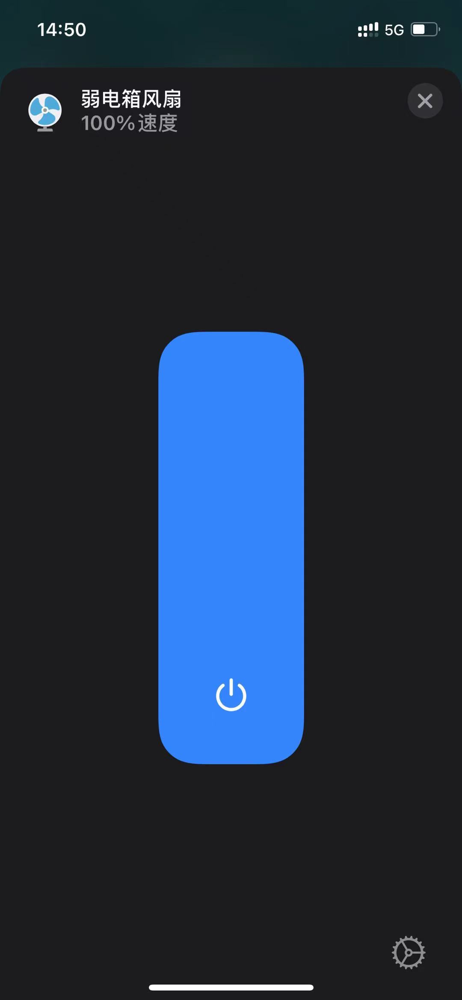
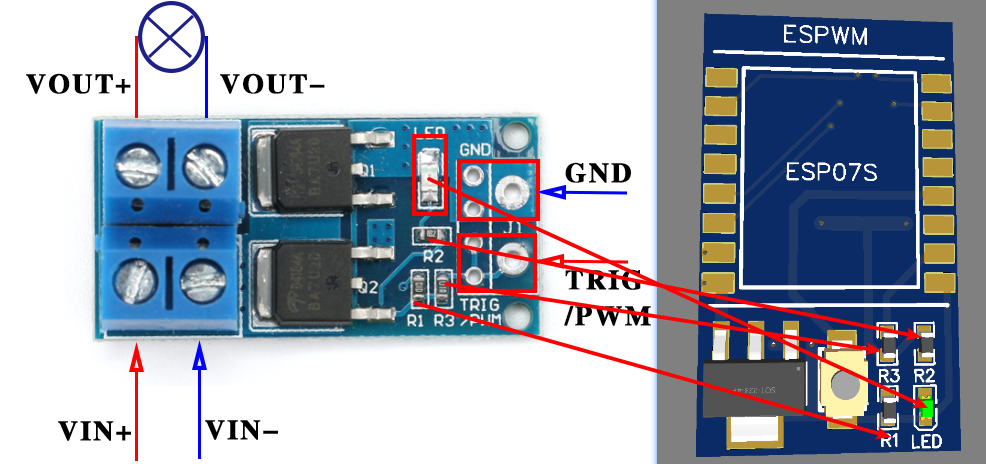

# ESPWM

## 简介





这是比较简单的模块，可控制普通`LED灯带`和`散热风扇`，实现亮度或风扇的无极调节。实际是`ESP`模块和`PWM`模块的组合，我只是加了`LDO`把她们组合在一起，并引出几个`GPIO`方便接入其他传感器。如果不需要PCB，可以直接买现成`ESP`和`PWM模块`实现（`材料清单一`内有）

[效果演示](https://www.bilibili.com/video/BV1wy4y1u7Bx)


## 目录

* [硬件](#硬件)
    * [材料清单一](#材料清单一)
    * [材料清单二](#材料清单二)
    * [焊接](#焊接)
* [软件](#软件)
    * [ESPHome](#ESPHome)
* [DIY](#DIY)
    * [步骤](#步骤)

## `硬件`

### `材料清单一`

| 名称 | 型号 | 数量 | PCB标注 | 链接 |
| ----- | ----- | ----: | :----: | :----: |
| TLE42744GSV33 LDO SOT-223 封装 | - | 1 | U1 | [购买](https://item.taobao.com/item.htm?id=596175129159) |
| PWM调节电子开关控制板 大功率MOS管模块 | - | 1 | - | [购买](https://item.taobao.com/item.htm?id=558594541986) |
| ESP8266串口转WIFI模块 ESP-07S 工业级 | - | 1 | ESP07S | [购买](https://item.taobao.com/item.htm?id=536432661872) |
| 2.4G内置柔性FPC软天线 | - | 1 | - | [购买](https://item.taobao.com/item.htm?id=574057911861) |
| 3*4 龟仔/微动/轻触开关 | - | 1 | SW | [购买](https://item.taobao.com/item.htm?id=546724645617) |
| 卧贴 1.25mm间距 连接器 接插件 | 8P | 1 | CN1 | [购买](https://item.taobao.com/item.htm?id=528819360986) |
| 1.25胶壳端子 1.25mm间距压簧 | - | - | - | [购买](https://item.taobao.com/item.htm?id=528804501334) |
| 胶壳 1.25mm间距 连接器 接插件 | 8P | - | - | [购买](https://item.taobao.com/item.htm?id=528730091171) |
| XH2.54 间距2.54MM SMT连接器 | 4P | 1 | CN2 | [购买](https://item.taobao.com/item.htm?id=553190289846) |
| XH2.54 XHB2.54 簧片 间距2.54MM 接线端子 | - | - | - | [购买](https://item.taobao.com/item.htm?id=522575889276) |
| XH2.54接插件 2.54mm 胶壳 | 4P | - | - | [购买](https://item.taobao.com/item.htm?id=522578104271) |

### `材料清单二`

| 名称 | 型号 | 数量 | PCB标注 | 链接 |
| ----- | ----- | ----: | :----: | :----: |
| TLE42744GSV33 LDO SOT-223 封装 | - | 1 | U1 | [购买](https://item.taobao.com/item.htm?id=596175129159) |
| AOD4184 D4184 N沟道场效应MOS管 50A 40V | - | 2 | Q1/Q2 | [购买](https://item.taobao.com/item.htm?id=621661261124) |
| 贴片电阻0603 10K | 0603 10K | 1 | R1 | [购买](https://item.taobao.com/item.htm?id=642138541174) |
| 贴片电阻0603 100R | 0603 100R | 1 | R3 | [购买](https://item.taobao.com/item.htm?id=642138541174) |
| 贴片电阻0603 1.8K | 0603 1.8K | 1 | R2 | [购买](https://item.taobao.com/item.htm?id=642140285577) |
| 0603 贴片LED常用元件包 （红蓝绿黄白） | - | 1 | LED | [购买](https://item.taobao.com/item.htm?id=526211410115) |
| ESP8266串口转WIFI模块 ESP-07S 工业级 | - | 1 | ESP07S | [购买](https://item.taobao.com/item.htm?id=536432661872) |
| 2.4G内置柔性FPC软天线 | - | 1 | - | [购买](https://item.taobao.com/item.htm?id=574057911861) |
| 3*4 龟仔/微动/轻触开关 | - | 1 | SW | [购买](https://item.taobao.com/item.htm?id=546724645617) |
| 卧贴 1.25mm间距 连接器 接插件 | 8P | 1 | CN1 | [购买](https://item.taobao.com/item.htm?id=528819360986) |
| 1.25胶壳端子 1.25mm间距压簧 | - | - | - | [购买](https://item.taobao.com/item.htm?id=528804501334) |
| 胶壳 1.25mm间距 连接器 接插件 | 8P | - | - | [购买](https://item.taobao.com/item.htm?id=528730091171) |
| XH2.54 间距2.54MM SMT连接器 | 4P | 1 | CN2 | [购买](https://item.taobao.com/item.htm?id=553190289846) |
| XH2.54 XHB2.54 簧片 间距2.54MM 接线端子 | - | - | - | [购买](https://item.taobao.com/item.htm?id=522575889276) |
| XH2.54接插件 2.54mm 胶壳 | 4P | - | - | [购买](https://item.taobao.com/item.htm?id=522578104271) |

### `焊接`

如果只需要少量可以按`材料清单一`购买。如果需要多个建议按`材料清单二`购买。按PCB标注焊接即可

#### `材料清单一`
其实就是挪板到PCB上


#### `材料清单二`

按PCB标注焊接即可

## `软件`

注意frequency的设置LED直接1000 Hz就好，太低会有频闪。

### `ESPHome`

```yaml

esphome:
  name: esp07s_demo
  platform: ESP8266
  board: esp07

wifi:
  ssid: "#WIFI名称#"
  password: "#WIFI密码#"

captive_portal:

logger:

api:
  password: '#api密码#'

ota:
  password: '#ota密码#'

web_server:
  port: 80
  
# PWM GPIO定义（灯的frequency设为1000 Hz是没有问题的,风扇设为60 Hz实际按测试结果为准）
output:
  - platform: esp8266_pwm
    pin: 15
    frequency: 1000 Hz
    inverted: False
    id: pwm_output

# LED灯
light:
  - platform: monochromatic
    output: pwm_output
    name: "esp07s_demo_pwm_light"

# 风扇
fan:
  - platform: speed
    output: pwm_output
    name: "esp07s_demo_pwm_fan"

```

## `DIY`

请参考之前DIY的[步骤](https://github.com/liwei19920307/S5in1#%E6%AD%A5%E9%AA%A4)