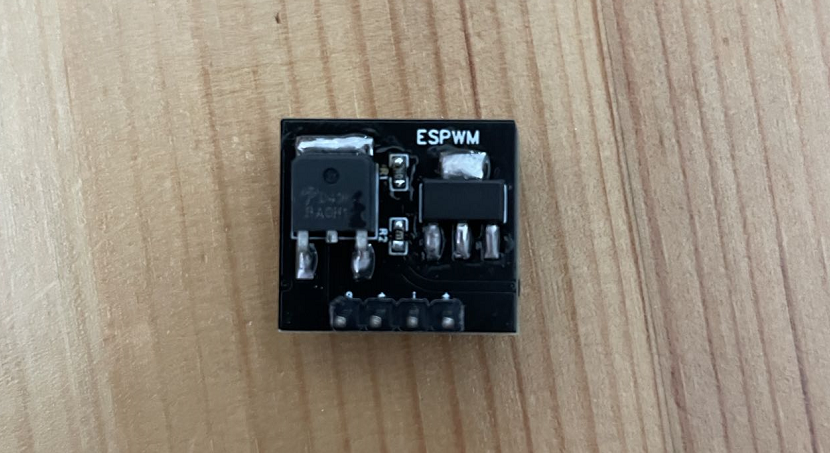
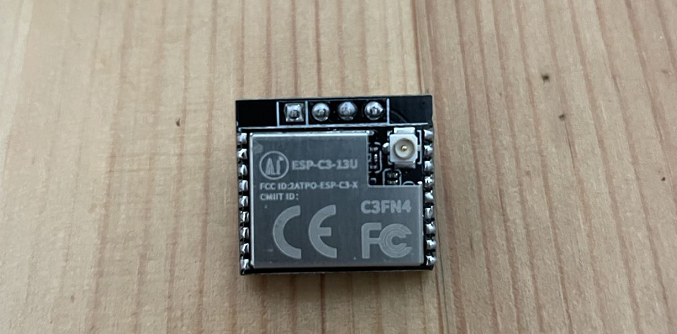
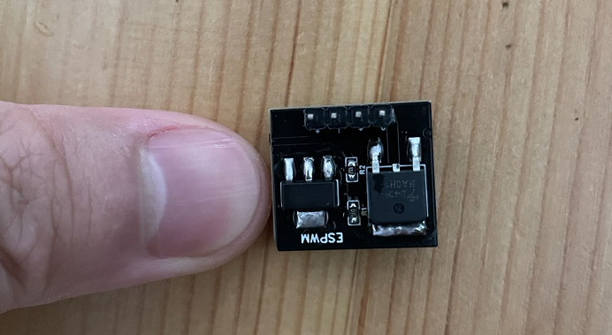

# ESPWM

## 简介





讨论群: `810581215`

由于之前的`LDO`涨价，所以替换成国产`LDO`。使用`ESP32C3`替代`8266`功耗小`LDO`发热也小。相比之前方案去掉一个`MOS`，体积更小，也并不影响使用。测试在`12V`电压

### `材料清单`

| 名称                                      | 型号      | 数量 |  PCB 标注  |                           链接                           |
| ----------------------------------------- | --------- | ---: | :--------: | :------------------------------------------------------: |
| ME1117A33B3G MICRONE南京微盟品牌 线性稳压器(LDO) 封装SOT-223 | -         |    1 |     M1     | [购买](https://item.taobao.com/item.htm?id=668286085588) |
| AOD4184 D4184 N 沟道场效应 MOS 管 50A 40V | -         |    1 |     A1     | [购买](https://item.taobao.com/item.htm?id=621661261124) |
| 贴片电阻 0603 10K                         | 0603 10K  |    1 |     R1     | [购买](https://item.taobao.com/item.htm?id=642138541174) |
| 贴片电阻 0603 100R                        | 0603 100R |    1 |     R2     | [购买](https://item.taobao.com/item.htm?id=642138541174) |
| 2.4G 内置柔性 FPC 软天线                  | -         |    1 |     -      | [购买](https://item.taobao.com/item.htm?id=574057911861) |
| ESP-C3-13U 模块                           | 4M        |    1 | ESP-C3-13U | [购买](https://item.taobao.com/item.htm?id=652413887471) |

### `ESPHome`

此配置不带`web`界面，需要配合`hass`食用

```yaml
esphome:
  name: espwm

esp32:
  board: esp32-c3-devkitm-1
  framework:
    type: esp-idf

logger:

api:
  password: !secret api_password

ota:
  password: !secret ota_password

wifi:
  ssid: !secret wifi_ssid
  password: !secret wifi_password
  fast_connect: on

output:
  - platform: ledc
    pin: 0
    frequency: 60Hz
    id: espwm_ledc

fan:
  - platform: speed
    output: espwm_ledc
    name: "espwm_fan"

light:
  - platform: monochromatic
    output: espwm_ledc
    name: "balcony_espwm_light"
```

此配置带`web`界面

```yaml
esphome:
  name: espwm
  platformio_options:
    platform: https://github.com/tasmota/platform-espressif32.git
    platform_packages:
      - framework-arduinoespressif32@https://github.com/espressif/arduino-esp32.git#2.0.2
    board_build.flash_mode: dio

esp32:
  board: esp32-c3-devkitm-1
  framework:
    type: arduino

logger:

api:
  password: !secret api_password

ota:
  password: !secret ota_password

wifi:
  ssid: !secret wifi_ssid
  password: !secret wifi_password
  fast_connect: on

web_server:
  port: 80

output:
  - platform: ledc
    pin: 0
    frequency: 60Hz
    id: espwm_ledc

fan:
  - platform: speed
    output: espwm_ledc
    name: "espwm_fan"

light:
  - platform: monochromatic
    output: espwm_ledc
    name: "balcony_espwm_light"
```
